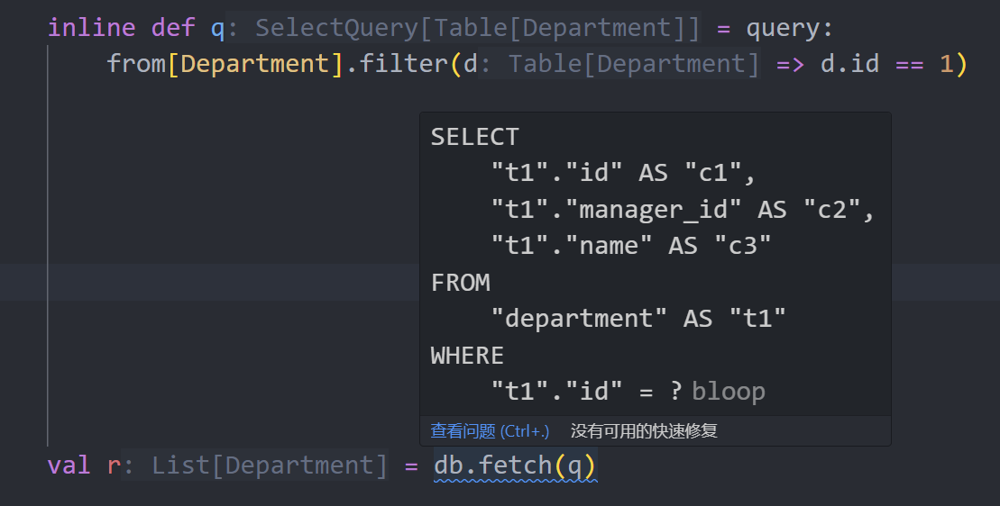
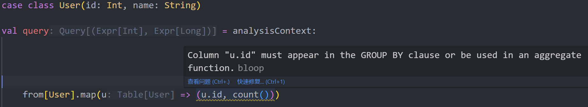

# Introduction to sqala

sqala is an SQL query library based on Scala 3, named after the combination of Scala and SQL.

Using sqala, you can achieve:

1. Building queries in an object-oriented manner:

    ```scala
    case class User(id: Int, name: String)

    val q = query:
        from[User]
            .filter(u => u.id == 1)
            .map(u => u.name)

    val i = insert(User(1, "Dave"))
    ```

2. Managing projections with named tuples, eliminating the need to predefine structures for projection results or use `Map[String, Any]`, and accessing returned fields using `.`:

    ```scala
    val q = query:
        from[User].map(u => (id = u.id))

    val result = db.fetch(q)

    for r <- result do
        println(r.id)
    ```

3. Utilizing Scala3's `inline` capability to generate high-performance deserialization code, which is 3-10 times faster than reflection-based Java mainstream query libraries.

4. Show SQL statement at compile time:

    

5. Capture wrong queries at compiletime, and return sematic compilation warning:

    

6. Supporting multiple dialects including MySQL, PostgreSQL, and Oracle, with the same query expression generating different SQL by passing different dialect parameters.

7. Supporting Oracle's recursive query feature `CONNECT BY`, but generating standard SQL that is compatible across databases:

    ```scala
    case class Department(id: Int, managerId: Int, name: String)

    val q = query:
        from[Department]
            .connectBy(d => prior(d.id) == d.managerId)
            .startWith(d => d.managerId == 0)
            .map(d => (id = d.id, managerId = d.managerId, name = d.name))
    ```

8. Beyond CRUD, sqala also supports advanced features like multidimensional grouping, subquery predicates, `LATERAL` subqueries, providing strong support for data analysis scenarios.

9. The `dynamic` module provides a DSL and SQL parser for dynamically constructing complex queries, supporting applications like dynamic report building.

10. No additional dependencies beyond Scala and Java official libraries.

## Precautions

1. Since sqala is not built on the Scala3 LTS version, caution is advised when using it in production environments until the next LTS version of Scala3 is released.

2. Ensure the Scala version is `3.7.0` or higher.

3. It is recommended to use the official Scala metals plugin with editors like VSCode, Vim, etc. Jetbrains IDEA currently cannot provide writing hints or correctly display the data types returned by queries.
