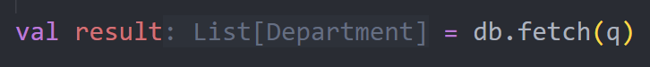
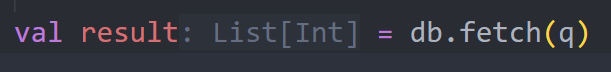
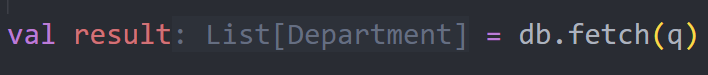
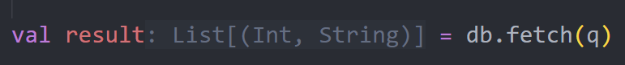
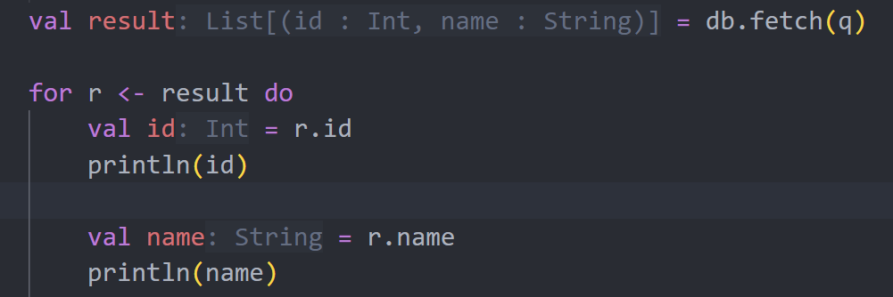
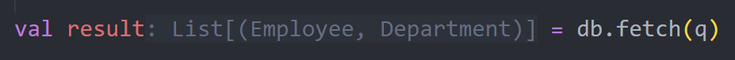
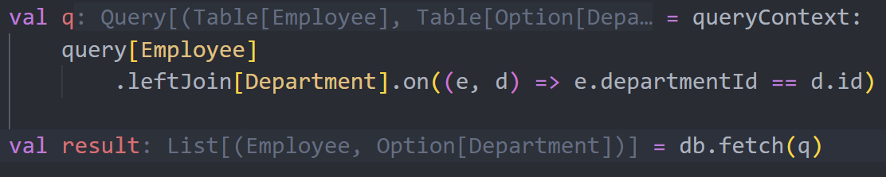
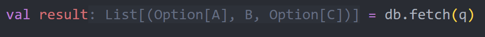

# Query

After configuring the metadata, we can start building queries. sqala uses an API similar to the Scala collections library to create queries.

The following usage requires importing:

```scala
import sqala.static.dsl.*
```

The generated queries in the following examples are based on the MySQL dialect. In actual use, sqala will generate appropriate SQL based on the dialect configuration.

## Building Queries

The `from` method is used to build queries, with the type parameter being the entity class type:

```scala
val q =
    from[Department]
```

The generated SQL is:

```sql
SELECT
    `t1`.`id` AS `c1`,
    `t1`.`manager_id` AS `c2`,
    `t1`.`name` AS `c3`
FROM
    `department` AS `t1`
```

The return type of this query is:



## Filtering

The `filter` (or `where`) method corresponds to the SQL `WHERE` clause. The parameter is a function of type `T => Expr[Boolean]`, describing the `WHERE` condition:

```scala
val id = 1

val q =
    from[Department].filter(d => d.id == id)
```

The generated SQL is:

```sql
SELECT
    `t1`.`id` AS `c1`,
    `t1`.`manager_id` AS `c2`,
    `t1`.`name` AS `c3`
FROM
    `department` AS `t1`
WHERE
    `t1`.`id` = 1
```

**Multiple calls to `filter` will connect the query conditions using AND.**

sqala provides the `filterIf` (or `whereIf`) method for dynamically splicing conditions. It will use `AND` to splice the condition into the query when the first parameter value is `true`:

```scala
val id = 1
val name = "IT"

val q =
    from[Department]
        .filterIf(id > 0)(_.id == id)
        .filterIf(name.nonEmpty)(_.name == name)
```

## Projection

The `map` (or `select`) method is used to manually specify the `SELECT` projection list. sqala allows projection to expressions, tables, and tuples or named tuples composed of them.

### Projection to Expression

```scala
val q =
    from[Department].map(d => d.id)
```

The generated SQL is:

```sql
SELECT
    `t1`.`id` AS `c1`
FROM
    `department` AS `t1`
```

The return type of the query is:



### Projection to Table

```scala
val q =
    from[Department].map(d => d)
```

The generated SQL is:

```sql
SELECT
    `t1`.`id` AS `c1`,
    `t1`.`manager_id` AS `c2`,
    `t1`.`name` AS `c3`
FROM
    `department` AS `t1`
```

The return type of the query is:



### Projection to Tuple

```scala
val q =
    from[Department].map(d => (d.id, d.name))
```

The generated SQL is:

```sql
SELECT
    `t1`.`id` AS `c1`,
    `t1`.`name` AS `c2`
FROM
    `department` AS `t1`
```

The return type of the query is:



### Projection to Named Tuple

Named tuples (NamedTuple) are a new feature in Scala 3.6. However, as of now (up to Scala 3.6.2), we still need to import:

```scala
import scala.language.experimental.namedTuples
```

to use them normally. Named tuples are expected to become a standard feature in Scala 3.7, at which point they can be used without importing.

Using named tuples, we can name the projected fields and directly use `.` to call the fields after the query, without pre-defining an entity class to receive the intermediate projection results:

```scala
val q =
    from[Department].map(d => (id = d.id, name = d.name))
```



## Using for-comprehension

sqala supports transforming simple queries that only use `filter` and `map` into `for` comprehensions to improve readability:

```scala
val q =
    from[Department]
        .filter(d => d.id == 1)
        .map(d => d.name)
```

Can be simplified to:

```scala
val q =
    for d <- from[Department]
        if d.id == 1
    yield d.name
```

## Limiting Results

The `take` (or `limit`) and `drop` (or `offset`) methods correspond to SQL's `LIMIT` and `OFFSET` functions, and will select the appropriate strategy based on the dialect when generating the query.

If only one of the methods is called, the default value for `LIMIT` is `Long.MaxValue`, and the default value for `OFFSET` is `0`.

```scala
val q =
    from[Department].drop(100).take(10)
```

## Table Joins

sqala supports `join`, `leftJoin`, `rightJoin` methods to join tables, and `on` for join conditions:

```scala
val q =
    from[Employee]
        .join[Department]
        .on((e, d) => e.departmentId == d.id)
```

The return type of the query is:



If the `join` in the above is changed to `leftJoin`, the return type is:



sqala will calculate the return type from the join path. For example, if we have:

```scala
case class A(id: Int)
case class B(id: Int)
case class C(id: Int)

val q =
    from[A]
        .rightJoin[B]((a, b) => a.id == b.id)
        .leftJoin[C]((a, b, c) => a.id == c.id)
```

Then, the return type of this query is:



This is because outer joins produce additional null values, and sqala will automatically add `Option` to types that may be null.

## Self-Join

sqala can easily handle cases where a table joins itself. For example, if our `Department` table records the `managerId` field, which is the id of the superior, we can use a self-join to query such data:

```scala
val q =
    from[Department]
        .join[Department]((d1, d2) => d1.managerId == d2.id)
```

However, for cases where the data table stores tree data, it is more convenient to use the `recursive query` function provided by sqala.

## Sorting

After projection, we can use the `sortBy` (or `orderBy`) method to sort. The parameter is the sorting rule of the expression or the tuple composed of them. Multiple `sortBy` (or `orderBy`) will be spliced in sequence:

```scala
val q =
    from[Department]
        .sortBy(d => (d.id, d.name.desc))
        .sortBy(d => d.managerId.asc)
```

The generated SQL is:

```sql
SELECT
    `t1`.`id` AS `c1`,
    `t1`.`manager_id` AS `c2`,
    `t1`.`name` AS `c3`
FROM
    `department` AS `tt1`
ORDER BY
    `t1`.`id` ASC,
    `t1`.`name` DESC,
    `t1`.`manager_id` ASC
```

Supported sorting rules are:

| Sorting Rule |
|:------------:|
|`asc`         |
|`desc`        |
|`ascNullsFirst`|
|`ascNullsLast`|
|`descNullsFirst`|
|`descNullsLast`|

If an expression is used directly without explicitly writing the sorting rule, sqala will fill it with `ASC`.

When generating dialects for databases like MySQL, sorting rules containing `NULLS` will be specially handled to avoid generating incorrect SQL.

## Grouping

The `groupBy` method corresponds to the SQL `GROUP BY` clause:

```scala
val q =
    from[Employee]
        .groupBy(e => e.departmentId)
        .map(e => (e.departmentId, count()))
```

The generated SQL is:

```sql
SELECT
    `t1`.`department_id` AS `c1`,
    COUNT(*) AS `c2`
FROM
    `employee` AS `t1`
```

If obtaining any value of an ungrouped field meets the requirement, the `anyValue` aggregate function can be used:

```scala
val q =
    from[Employee]
        .groupBy(e => e.departmentId)
        .map(e => (e.departmentId, anyValue(e.id)))
```

### Limitations of Grouping

Since sqala generates value expressions as JDBC precompiled placeholders `?`, in queries like the following:

```scala
val q = from[Department]
    .groupBy(d => d.id + 1)
    .map(d => (d.id + 1, count()))
```

SQL similar to the following will be generated:

```sql
SELECT
    "t1"."id" + ? AS "c1",
    COUNT(*) AS "c2"
FROM
    "department" AS "t1"
GROUP BY
    "t1"."id" + ?
```

When using PostgreSQL, due to strict driver validation, the database cannot determine that the two `?` are the same expression, and this query will throw an error at runtime.

We can add `?preferQueryMode=simple` to the database connection to disable precompilation, or change the query to a subquery form:

```scala
val q = queryContext:
    val subquery =
        from[Department]
            .map(d => (x = d.id + 1))

    fromQuery(subquery).groupBy(q => q.x).map(q => (q.x, count()))
```

## Multi-dimensional Grouping

In addition to ordinary grouping, sqala also supports `groupByCube`, `groupByRollup`, `groupBySets` for multi-dimensional grouping. The first two are used similarly to `groupBy`:

```scala
val q =
    from[Employee]
        .groupByCube(e => (e.departmentId, e.name))
        .map(e => (e.departmentId, e.name, count()))
```

Or:

```scala
val q =
    from[Employee]
        .groupByRollup(e => (e.departmentId, e.name))
        .map(e => (e.departmentId, e.name, count()))
```

Additionally, the `grouping` aggregate function can be used with multi-dimensional grouping (this function is not supported by databases like Sqlite):

```scala
val q =
    from[Employee]
        .groupByCube(e => (e.departmentId, e.name))
        .map: e =>
            (grouping(e.departmentId), e.departmentId, grouping(e.name), e.name, count())
```

`groupBySets` takes a grouping set composed of basic groupings (empty grouping sets are represented by the Unit type):

```scala
val q =
    from[Employee]
        .groupBySets(e => ((e.departmentId, e.name), e.name, ()))
        .map(e => (e.departmentId, e.name, count()))
```

## Deduplication

Use the `distinct` method to deduplicate the result set:

```scala
val q =
    from[Department].map(d => d.name).distinct
```

## Subqueries

Databases generally support three types of subqueries:

    1. Predicate subqueries in clauses like `WHERE` and `ON`;
    2. Table subqueries in `FROM` and `JOIN`;
    3. Scalar subqueries in `SELECT` clauses.

sqala supports all of the above subqueries.

### Predicate Subqueries

Predicate subqueries are usually used with operations like `IN`, `ANY`, `ALL`, `EXISTS`:

```scala
val q1 =
    from[A].filter: a =>
        a.x.in(from[B].map(b => b.x))

val q2 =
    from[A].filter: a =>
        a.x == any(from[B].map(b => b.x))

val q3 =
    from[A].filter: a =>
        a.x != all(from[B].map(b => b.x))

val q4 =
    from[A].filter: a =>
        exists(from[B].filter(b => b.x > 0))
```

Subqueries of the above types, except for `exists`, need to project to a type that matches the outer expression.

Predicate subqueries can also use operators directly without the above operations:

```scala
val q1 =
    from[A].filter: a =>
        a.x == from[B].map(b => b.x).take(1)

val q2 =
    from[A].filter: a =>
        a.x > from[B].map(b => sum(b.x))
```

### Table Subqueries

sqala supports placing subqueries in table joins. The prerequisite for using table subqueries is that the subquery **projects to a named tuple**. At this point, we can use `.` to call the fields of the subquery:

```scala
val q =
    val subquery = from[B].map(b => (x = b.x, y = b.y))

    from[A].leftJoinQuery(subquery).on((a, q) => a.x == q.x)
```

`joinLateral` and `leftJoinLateral` subqueries support using fields from the outer table:

```scala
val q =
    from[A].leftJoinLateral(a =>
        from[B].filter(b => a.z > b.z).map(b => (x = b.x, y = b.y))
    ).on((a, q) => a.x == q.x)
```

**This is implemented using the database's LATERAL feature. Please ensure that the database version supports this feature when using it.**

The `fromQuery` method supports nesting a query that returns a **named tuple** as a subquery:

```scala
val q = fromQuery(from[A].map(a => (x = a.x, y = a.y)))
```

This method can transform `UNION` and other queries into subqueries, allowing the use of filtering, grouping, and other functions unique to `SELECT` statements.

### Scalar Subqueries

Subqueries can be placed in the projection result using `map`, provided that:

    1. The subquery returns only one row of data;
    2. The subquery returns only one column of data, and needs to be projected to a single field using `map`.

Subqueries that meet the above rules can be placed in the `map` list:

```scala
val q =
    val scalarQuery = from[B].map(b => sum(b.x))
    from[A].map(a => (a.x, scalarQuery))
```

## Set Operations

sqala supports using `union`, `unionAll`, `intersect`, `intersectAll`, `except`, `exceptAll` and other methods to handle set queries, for example:

```scala
val q =
    val q1 = from[Department]
        .filter(d => d.id == 1)
        .map(d => (id = d.id, name = d.name))

    val q2 = from[Department]
        .filter(d => d.id == 2)
        .map(d => (id = d.id, name = d.name))

    q1 unionAll q2
```

Since `UNION ALL` is semantically consistent with set concatenation, the above `unionAll` can be abbreviated as `++`:

```scala
q1 ++ q2
```

For queries on both sides of the set operation:

    1. If it is a single table query, all field types of the two queries must match, and the return result will be based on the first entity class type.

    2. If it is a projection query, their return types must have the same number of columns and the types must correspond one-to-one. For example, if there are two queries returning:
        `(Option[Int], String, Option[LocalDate])`

        and:

        `(Int, Option[String], LocalDate)`

        , then calling a set operation on these two queries will return:

        `(Option[Int], Option[String], Option[LocalDate])`
        .

Except for the first query needing to project to a named tuple, subsequent queries can project to tuples. When using this query as a subquery or receiving database return results, the field names will be based on the first query:

```scala
// When used as a subquery, the fields are id and name
val q =
    val q1 = from[Department].map(d => (id = d.id, name = d.name))
    val q2 = from[Department].map(d => (d.id, d.name))

    q1 union q2
```

## Creating Queries from In-Memory Collections

Use the `fromValues` method to create queries from in-memory collections. This query can use projection, filtering, and other operations, and can be used with other queries for `join` or `union` operations:

```scala
case class Entity(id: Int, name: String)

val list = List(Entity(1, "Dave"), Entity(2, "Ben"))

val q = fromValues(list).filter(e => e.id > 0)
```

**This feature is implemented using the database's `VALUES` statement. Please ensure that the current database version supports this syntax when using it.**

## Recursive Queries

The `department` table stores tree data. If we want to query an entire department tree in the `department` table, it usually requires multiple queries. However, sqala borrows from the `CONNECT BY` feature of the Oracle dialect and uses the `connectBy` method to create recursive queries, eliminating the need for multiple queries and wasting database performance. When generating SQL, it will be converted to the SQL standard `CTE (Common Table Expression)` query, without requiring the database itself to support `CONNECT BY`:

```scala
val q =
    from[Department]
        .connectBy(d => prior(d.id) == d.managerId)
        .startWith(d => d.managerId == 0)
        .map(d => (id = d.id, managerId = d.managerId, name = d.name))
```

`connectBy` is used to create recursive join conditions, where `prior` is used to reference recursive query columns. For specific rules, please refer to the Oracle documentation.

`startWith` is used to initial condition of the recursion.

`sortSiblingsBy` method refers to the ranking rule for **each level**, while `sortBy` refers to the while ranking rule:

```scala
val q =
    from[Department]
        .connectBy(d => prior(d.id) == d.managerId)
        .startWith(d => d.managerId == 0)
        .sortSiblingsBy(d => d.name)
        .map(d => (id = d.id, managerId = d.managerId, name = d.name))
```

`maxDepth` is used to limit the maximum of recursion:

```scala
val q =
    from[Department]
        .connectBy(d => prior(d.id) == d.managerId)
        .startWith(d => d.managerId == 0)
        .sortSiblingsBy(d => d.name)
        .maxDepth(5)
        .map(d => (id = d.id, managerId = d.managerId, name = d.name))
```

projection and ranking can use fake column `level()` which refers to level of current recursion. It starts with level 1.

```scala
val q =
    from[Department]
        .connectBy(d => prior(d.id) == d.managerId)
        .startWith(d => d.managerId == 0)
        .sortSiblingsBy(d => d.name)
        .maxDepth(5)
        .map(d => (id = d.id, managerId = d.managerId, name = d.name, level = level()))
```

## PivotTable

In data analysis scenerios, it is common to transform rows to columns with aggragation functions and `CASE WHEN` expression, sqala also supports this:

```scala
case class City(population: Int, year: Int, country: String)

val q =
    from[City]
        .map: c =>
            (
                total_2000 = sum(`if` c.year == 2000 `then` c.population `else` 0),
                total_2001 = sum(`if` c.year == 2001 `then` c.population `else` 0),
                count_2000 = count(`if` c.year == 2000 `then` Some(1) `else` None),
                count_2001 = count(`if` c.year == 2001 `then` Some(1) `else` None)
            )
```

And sqala supports a cleaner way to write above query with `pivot`:

```scala
val q =
    from[City]
        .pivot(c => (total = sum(c.population), count = count(1)))
        .`for`: c =>
            (
                c.year.within(`2000` = 2000, `2001` = 2001)
            )
```

In `pivot`, we invoke several aggregation functions. In `for` we use `within` to include projection columns. Sqala automatically convert this to queries like `SUM(CASE WHEN ...)` without database itself supporting `PIVOT`. And sqala will automatically handle the return type as following:

```scala
val result:
    List[
        (
            total_2000 : Option[Int],
            total_2001 : Option[Int],
            count_2000 : Long,
            count_2001 : Long
        )
    ] =
        db.fetch(q)
```

If other expressions are used inside `for`:

```scala
val q =
    from[City]
        .pivot(c => (total = sum(c.population), count = count(1)))
        .`for`: c =>
            (
                c.year.within(`2000` = 2000, `2001` = 2001),
                c.country.within(cn = "CN", us = "US")
            )
```

Then the return type will be:

```scala
val result:
    List[
        (
            total_2000_cn : Option[Int],
            total_2000_us : Option[Int],
            total_2001_cn : Option[Int],
            total_2001_us : Option[Int],
            count_2000_cn : Long,
            count_2000_us : Long,
            count_2001_cn : Long,
            count_2001_us : Long
        )
    ] =
        db.fetch(q)
```

<!-- ## Semantic Analysis

sqala supports static semantic analysis at compile time. And common sql sematic error will be transformed to compilation warnings. To use semantic analysis, please place your queries under `analysisContext`. (This does not support `pivot` at the moment)

```scala
val q = analysisContext:
    from[Department]
``` -->
