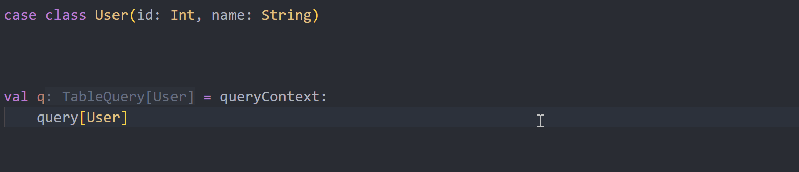

# sqala简介

sqala是一个基于Scala 3的SQL查询库，得名于Scala和SQL的结合。

使用sqala，你可以：

1. 使用面向对象的方式构建查询：

    ```scala
    case class User(id: Int, name: String)

    val q = queryContext:
        query[User]
            .filter(u => u.id == 1)
            .map(u => u.name)

    val i = insert(User(1, "小黑"))
    ```

2. 使用Scala的表达式生成查询：

    ```scala
    val q = queryContext:
        for u <- query[User] yield if u.id == 1 then 1 else 0
    ```

    生成：

    ```sql
    SELECT
        CASE WHEN "u"."id" = 1 THEN 1 ELSE 0 END
    FROM
        "user" AS "u"
    ```

3. 使用命名元组管理投影，无需为投影结果预先创建结构接收，也无需使用`Map[String, Any]`，并使用`.`调用返回字段：

    ```scala
    val q = queryContext:
        query[User].map(u => (id = u.id))

    val result = db.fetch(q)

    for r <- result do
        println(r.id)
    ```

4. 在编译期捕捉错误查询，并返回语义化的编译错误：

    

5. 支持MySQL、PostgreSQL、Oracle在内的多种方言，同一个查询表达式传入不同的方言参数即可生成不同的SQL。

6. 支持Oracle、PostgreSQL等数据库提供的高级功能，但会生成各数据库通用的标准SQL：

    Oracle的`CONNECT BY`：

    ```scala
    case class Department(id: Int, managerId: Int, name: String)

    val q = queryContext:
        query[Department]
            .connectBy(d => prior(d.id) == d.managerId)
            .startWith(d => d.managerId == 0)
            .map(d => (id = d.id, managerId = d.managerId, name = d.name))
    ```

    PostgreSQL的`DISTINCT ON`：

    ```scala
    val q = queryContext:
        query[User]
            .distinctOn(u => (name = u.name))
            .map((d, u) => (d.name, u.id))
    ```

7. 不仅是CRUD，sqala还支持多维分组、子查询谓词、`LATERAL`子查询、函数表、透视表等高级功能，为数据分析场景也提供了有力支撑。

8. 使用原生SQL，并自动从原生SQL中抽取结果类型，使用`.`调用返回字段，保持类型安全：

    ```scala
    val id = 1

    val sql = staticSql"""
    SELECT "id", "name" FROM "user" WHERE "id" = $id
    """

    val result = db.fetch(q)

    for r <- result do
        println(r.id)
        println(r.name)
    ```

9. `dynamic`模块提供了可以动态构造复杂查询的DSL和SQL解析器，为动态构建报表等应用提供支持。

10. `data`模块提供了JSON序列化、反序列化功能；0开销的对象映射功能。

11. 除Scala、Java标准库外，没有额外依赖。

## 注意事项

1. 由于sqala目前使用了Scala3的实验性功能，且没有基于Scala3 LTS版本构建，在Scala3发布下一个LTS版本之前，应用在生产环境需谨慎。

2. 请确保Scala版本在`3.6.2`及以上。并开启实验性特性编译选项`-experimental`。

3. 尽量使用Scala官方的metals插件配合VSCode、Vim等工具使用，IDEA系列目前无法获得编写提示，也无法正确显示查询返回的数据类型。