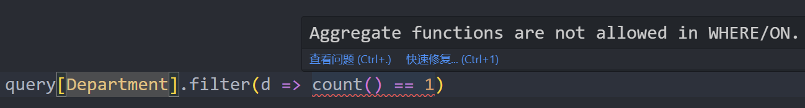
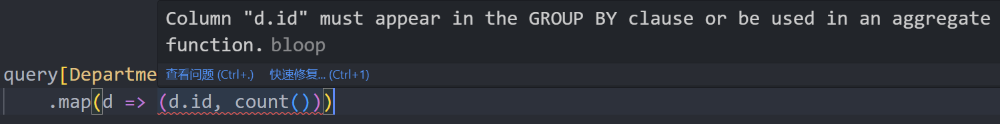
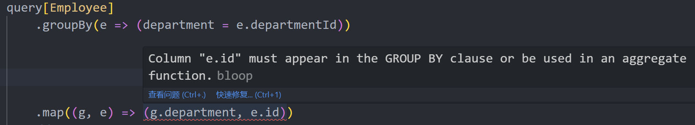

# 查询

在配置好元数据之后，我们就可以开始构建查询了，sqala使用类似Scala集合库风格的api创建查询。

以下用法均需要导入：

```scala
import sqala.static.dsl.*
import sqala.static.dsl.given
```

以下示例中生成的查询均以MySQL方言为例，实际使用时sqala会根据方言配置生成合适的SQL。

## 构建查询

sqala的查询需要放在`queryContext`方法中构建，该方法提供了构造查询需要的上下文。

`query`方法用于构建查询，类型参数是实体类类型：

```scala
val q = queryContext:
    query[Department]
```

生成的SQL为：

```sql
SELECT 
    `department`.`id`,
    `department`.`manager_id`,
    `department`.`name`
FROM
    `department` AS `department`
```

此查询的返回类型为：


## 过滤

`filter`方法对应到SQL的`WHERE`子句，参数是一个`T => Boolean`类型的函数，描述`WHERE`条件：

```scala
val id = 1

val q = queryContext:
    query[Department].filter(d => d.id == id)
```

生成的SQL为：

```sql
SELECT 
    `d`.`id`,
    `d`.`manager_id`,
    `d`.`name`
FROM
    `department` AS `d`
WHERE
    `d`.`id` = 1
```

**多次调用`filter`时将会使用AND来连接查询条件。**

sqala提供了`filterIf`方法用于动态拼接条件，会在第一个参数值为`true`时使用`AND`将条件拼接到查询中：

```scala
val id = 1
val name = "部门1"

val q = queryContext:
    query[Department]
        .filterIf(id > 0)(_.id == id)
        .filterIf(name.nonEmpty)(_.name == name)
```

### 过滤的限制

sqala会检查`filter`中的表达式，如果其中包含聚合函数、窗口函数等表达式，则会返回编译错误：



## 投影

`map`方法用于手动指定`SELECT`投影列表，sqala允许投影到表达式、表达式组成的元组、表达式组成的命名元组。

### 投影到表达式

```scala
val q = queryContext:
    query[Department].map(d => d.id)
```

生成的SQL为：

```sql
SELECT 
    `d`.`id`
FROM
    `department` AS `d`
```

在数据库查询时，sqala会自动推导返回类型：


### 投影到元组

```scala
val q = queryContext:
    query[Department].map(d => (d.id, d.name))
```

生成的SQL为：

```sql
SELECT 
    `d`.`id`,
    `d`.`name`
FROM
    `department` AS `d`
```

查询的返回类型为：


### 投影到命名元组

命名元组（NamedTuple）是Scala 3.6版本后新增功能，但目前（截止到Scala 3.6.2），我们仍需要导入：

```scala
import scala.language.experimental.namedTuples
```

才能正常使用，命名元组预计在Scala 3.7版本转为标准特性，届时将无需导入即可使用。

利用命名元组，我们可以给投影的字段起名，并在查询后直接使用`.`来调用字段，无需对投影中间结果预先定义实体类接收：

```scala
val q = queryContext:
    query[Department].map(d => (id = d.id, name = d.name))
```


### 投影的限制

在投影中如果同时出现了聚合函数和其他表达式，sqala会在编译期检查并返回编译错误：



## 使用for推导式

sqala支持将只使用了`filter`和`map`的简单查询转变为`for`推导式，提高可读性：

```scala
val q = queryContext:
    query[Department]
        .filter(d => d.id == 1)
        .map(d => d.name)
```

可以简写为：

```scala
val q = queryContext:
    for d <- query[Department]
        if d.id == 1
    yield d.name
```

## 限制结果

`take`和`drop`对应SQL的`LIMIT`和`OFFSET`等功能，并且会在生成查询时根据方言选取合适的策略。

如果只调用其一方法，那么`LIMIT`的默认值是`1`，`OFFSET`的默认值是`0`。

```scala
val q = queryContext:
    query[Department].drop(100).take(10)
```

## 表连接

sqala支持`join`、`leftJoin`、`rightJoin`方法连接表，`on`添加连接条件：

```scala
val q = queryContext:
    query[Employee]
        .join[Department]
        .on((e, d) => e.departmentId == d.id)
```

`.on`可以省略：

```scala
val q = queryContext:
    query[Employee]
        .join[Department]((e, d) => e.departmentId == d.id)
```

查询返回的类型为：


如果将上文中的`join`改为`leftJoin`，则返回类型为：


sqala会从连接路径中计算返回类型，比如我们有：

```scala
case class A(id: Int)
case class B(id: Int)
case class C(id: Int)

val q = queryContext:
    query[A]
        .rightJoin[B]((a, b) => a.id == b.id)
        .leftJoin[C]((a, b, c) => a.id == c.id)
```

那么，此查询的返回类型为：


这是由于外连接会产生额外的空值，sqala会将可能为空的类型自动添加上`Option`。

## 自连接

sqala可以很方便地处理一个表连接自身的情况，比如我们的`Department`表记录了`managerId`字段，即上级的id，我们可以使用自连接查询这样的数据：

```scala
val q = queryContext:
    query[Department]
        .join[Department]((d1, d2) => d1.managerId == d2.id)
```

但是对于这样数据表存储树形数据的情况，更方便的做法是使用sqala提供的`递归查询`功能。

## 分组

`groupBy`方法对应SQL的`GROUP BY`子句，参数为表达式组成的命名元组：

```scala
val q = queryContext:
    query[Employee]
        .groupBy(e => (department = e.departmentId))
        .map((g, e) => (g.department, count()))
```

生成的SQL为：

```sql
SELECT 
    `e`.`department_id`,
    COUNT(*)
FROM
    `employee` AS `e`
```

在分组后的`map`等操作里，第一个参数是分组表达式的命名元组，后续参数是未分组的表，如果是单表查询，一共有两个参数，如果是两表连接查询，一共有三个参数，以此类推。

sqala会对查询进行语义检查，从未分组表中引用出的字段，除非将其放入聚合函数，否则无法通过编译：



如果得到未分组字段的任意值即可满足需求，可以使用`anyValue`聚合函数：

```scala
val q = queryContext:
    query[Employee]
        .groupBy(e => (department = e.departmentId))
        .map((g, e) => (g.department, anyValue(e.id)))
```

由于在`groupBy`中我们已经为分组表达式起了别名，所以如果分组表达式比较复杂，在后续使用时不需要将表达式重复一次：

```scala
val q = queryContext:
    query[Employee]
        .groupBy: e => 
            (s = 
                if e.salary >= 50000 then "高"
                else if e.salary >= 20000 && e.salary < 50000 then "中"
                else "低"
            )
        .map((g, e) => (g.s, count()))
```

## 多维分组